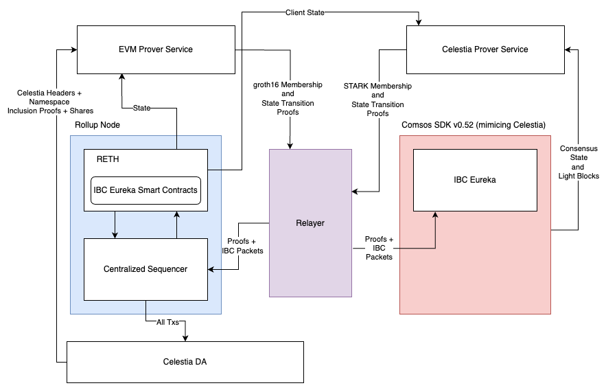

# ZK EVM IBC demo

> [!WARNING]
> This repository is a work in progress and under active development.

This repo exists to showcase transferring tokens between SimApp (a Cosmos SDK chain representing Celestia) and a ZK proveable EVM via [IBC V2](https://github.com/cosmos/ibc/blob/main/spec/IBC_V2/README.md) (formerly known as IBC Eureka) and the IBC V2 [solidity contracts](https://github.com/cosmos/solidity-ibc-eureka/blob/main/README.md). The diagram below is meant to detail the components involved and, at a high level, how they interact with one another.



For more information refer to the [architecture](./docs/ARCHITECTURE.md). Note that the design is subject to change.

## Usage

### Preamble

SP1 supports generating proofs in mock mode or network mode. By default, mock mode is used which is faster for testing and development purposes. Network mode is used for production purposes to generate real proofs. To use network mode, modify your `.env` file:

```env
SP1_PROVER=network
NETWORK_PRIVATE_KEY="PRIVATE_KEY" to the SP1 prover network private key from Celestia 1Password
```

### Prerequisites

1. Install [Docker](https://docs.docker.com/get-docker/)
1. Install [Rust](https://rustup.rs/)
1. Install [Foundry](https://book.getfoundry.sh/getting-started/installation)
1. Install [Bun](https://bun.sh/)
1. Install [Just](https://just.systems/man/en/)
1. Install [SP1](https://docs.succinct.xyz/docs/sp1/getting-started/install)

### Steps

1. Fork this repo and clone it
1. Set up the git submodule for `solidity-ibc-eureka`

    ```shell
    git submodule init
    git submodule update
    ```

1. Create the `.env` file in this repo

    ```shell
    cp .env.example .env
    ```

1. Run sp1up

    ```shell
    sp1up
    ```

1. Install contract dependencies and the SP1 Tendermint light client operator binary from solidity-ibc-eureka.

    ```shell
    make install-dependencies
    ```

1. Build the docker images

    ```shell
    make build-celestia-prover-docker
    make build-evm-prover-docker
    make build-indexer-docker
    make build-simapp-docker
    ```

1. Copy the proto_description.bin file one directory up in celestia prover
    ```shell
    cp ./provers/celestia-prover/prover/proto_descriptor.bin ./provers/celestia-prover/
    ```

1. Run the Celestia prover
    ```shell
    cargo run --package celestia-prover
    ```

1. Run the demo in a different terminal window

    ```shell
    # This runs make start, setup, and transfer
    make demo
    ```

## Architecture

See [ARCHITECTURE.md](./docs/ARCHITECTURE.md) for more information.

## Contributing

See [CONTRIBUTING.md](./docs/CONTRIBUTING.md) for more information.
