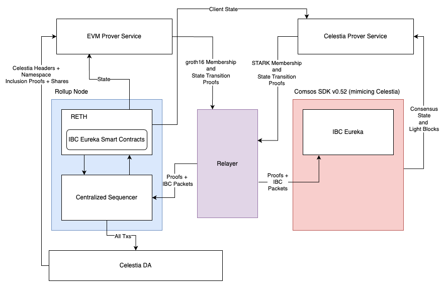

# Architecture



// TODO: The STARK proofs in this diagram are actually Groth16 proofs.

```mermaid
architecture-beta
    group evmrollup[EVM Rollup]
    service beaconkit[BeaconKit] in evmrollup
    group reth[Reth] in evmrollup
    service tendermintlightclient[Tendermint light client] in reth


    group simapp[SimApp]
    service groth16lightclient[Groth16 light client] in simapp

    group celestia[Celestia]
    service celestiavalidator[Celestia Validator] in celestia
    service celestiabridge[Celestia Bridge] in celestia

    service evmprover[EVM Prover]
    service celestiaprover[Celestia Prover]

    service relayer[Relayer]

    beaconkit{group}:B -- T:celestiavalidator{group}
    evmprover:B -- T:beaconkit{group}
    celestiaprover:B -- T:groth16lightclient{group}
```

## IBC Transfer flow

This section takes the diagram from above and breaks down each step to help aid your understanding.


1. The user submits a transfer message. This is a `MsgSendPacket` with an `ICS20LibFungibleTokenPacketData`. As well as who it's sending the tokens to and how much it also specifies where this packet is going to and lets the eventual receiver know where the packet came from.
1. The SimApp chain (mimicking Celestia) executes the transaction. It checks the user's balance and then moves the funds to a locked acount. It stores a commitment to this execution in state. This is kind of like a verifiable receipt.
1. Now the relayer kicks in. It listens to events that SimApp has emitted that there are pending packets ready to be sent to other chains. It queries the chain for the receipt based on a predetermined location.
1. The relayer needs to prove to the EVM rollup that SimApp has actually successfully executed the first part of the transfer: locking up the tokens. Proving this requires two steps: First the relayer queries a state transition proof from the celestia-prover. This will prove the latest state root from the last trusted state root stored in the state of the ICS07 Tendermint smart contract on the EVM. Now the EVM has an up to date record of SimApp's current state (which includes the receipt). Second, the relayer asks the celestia-prover for a proof that the receipt is a merkle leaf of the state root.
1. The celestia-prover has a zk circuit for generating both proofs. One takes tendermint headers and uses the `SkippingVerification` algorithm to assert the latest header. The other takes IAVL merkle proofs and proves some leaf key as part of the root. These are both SP1 proofs which can be processed by the smart contracts on the EVM.
1. The last step of the relayer is to combine these proofs and packets and submit a `MsgUpdateClient` and `MsgRecvPacket` to the EVM rollup.
1. The EVM executes both messages. It verifies the SP1 proofs and updates it's local record of SimApp's state. It then uses the updated state to verify that the receipt that the packet refers is indeed present in SimApp's state. Once all the verification checks are passed, it mints the tokens and adds them to the account of the recipient as specified in the packet. The rollup then writes it's own respective receipt that it processed the corresponding message.

The remaining steps mirror the previous steps but now in the opposite direction to acknowledge the transfer success back on SimApp. Note these steps haven't been implemented.

1. Similarly, the relayer listens for events emitted from the EVM rollup for any packets awaiting to be sent back. Upon receiving the packet to be returned, an acknowledgement of the transfer to be sent back to SimApp, it talks to the evm-prover to prepare the relevant proofs. While they are of different state machines and different state trees, the requests are universal: a proof of the state transition and a proof of membership. The evm-prover generates Groth16 proofs for SimApp's groth16 IBC Client.
1. The relayer then sends a `MsgUpdateClient` with the state transition proof to update SimApp's record of the Rollup's state after the point that it processed the transfer packet and wrote the receipt. The relayer also sends a `MsgAcknowledgement` which contains the membership proof of the commitment, a.k.a. the receipt alongside the details of the receipt i.e. for what transfer message are we acknowledging.
1. SimApp processes these two messages. It validates the proofs and if everything is in order, it removes the transfer receipt and keeps one final receipt of the acknowledgement (to prevent a later timeout message).

In the case that the EVM decided these messages were not valid it would not write the acknowledgement receipt. The relayer, tracking the time when the transfer message was sent would submit a `MsgTimeout` instead of the acknowledgement with an absence proof. This is a proof that no acknowledgement was written where the predermined path says it should be written. When SimApp receives this timeout and the corresponding absence proof, it reverses the transfer, releaseing the locked funds and returning them to the sender. This process is atomic - funds can not be unlocked if they are minted on the other chain.

If someone were to send tokens from the EVM rollup back to SimApp, the source chain of those tokens, the process would be very similar, however the actions wouldn't be to lock and mint but rather the EVM rollup would burn tokens and SimApp would unlock them.
