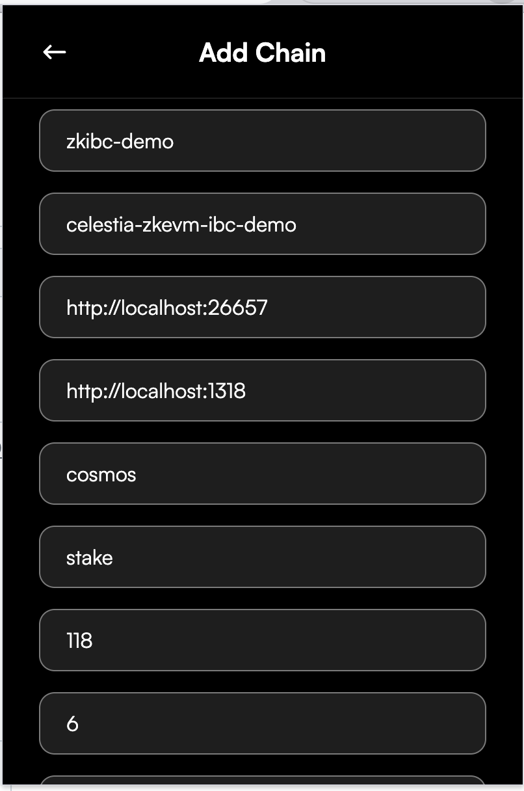
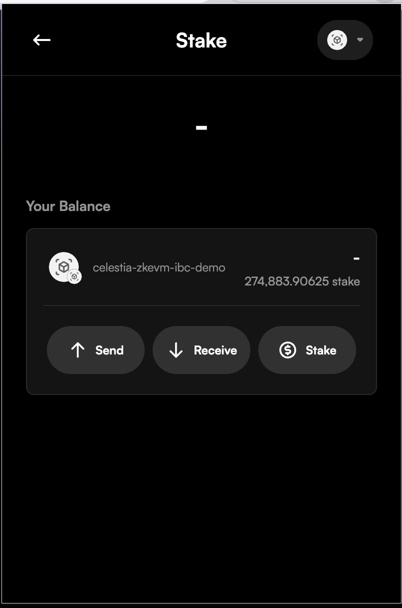

# Leap

To connect Leap wallet to SimApp mimicking Celestia, you need to:

1. Import the cosmos user private key into leap. Private key:
`886b34eed9392554ebc9d98904a44c53170fb559f6d509052c112bcc26bcd013`

1. Click on the network dropdown at the top right.

1. Click the `+` button.

1. Fill in the details following the screenshot.

    

1. The network should now appear in your wallet and should show stake balance in `Your tokens`.

1. Click on it to expand like so:

    
