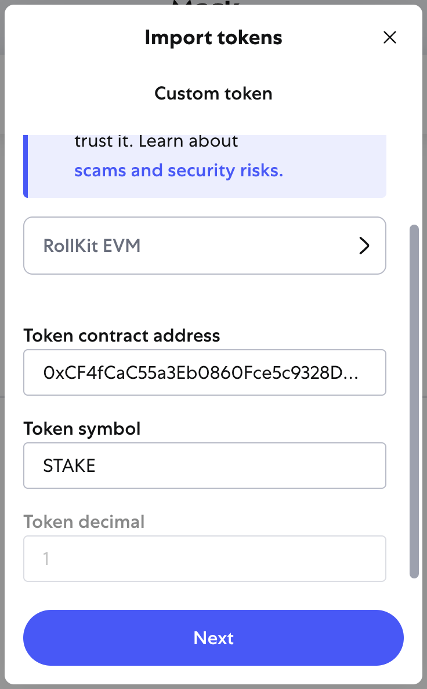

# Metamask

To connect Metamask to the EVM roll-up, you need to:

1. Import the private key of the transfer receiver into Metamask. Private key: `0x82bfcfadbf1712f6550d8d2c00a39f05b33ec78939d0167be2a737d691f33a6a`

1. Add a custom network.

    

1. Import a custom token. Use Chrome dev tools to remove the `disabled` attribute for the decimals text input and override the decimals to 1.

    
