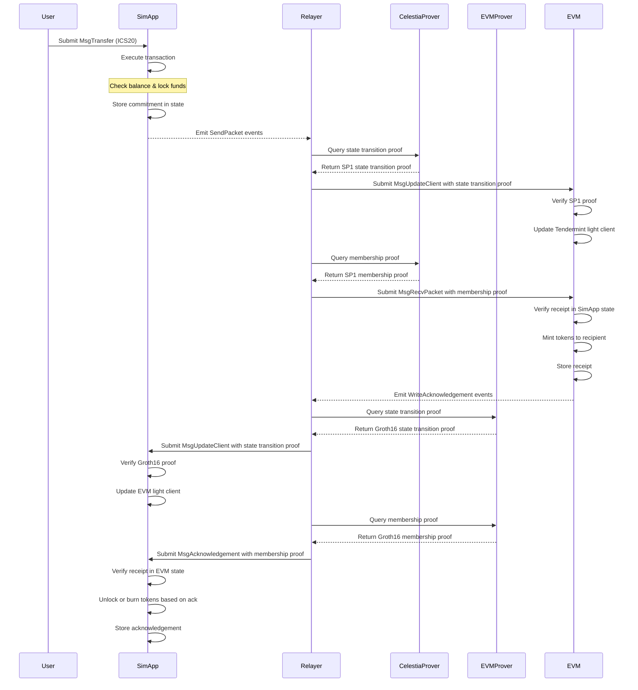
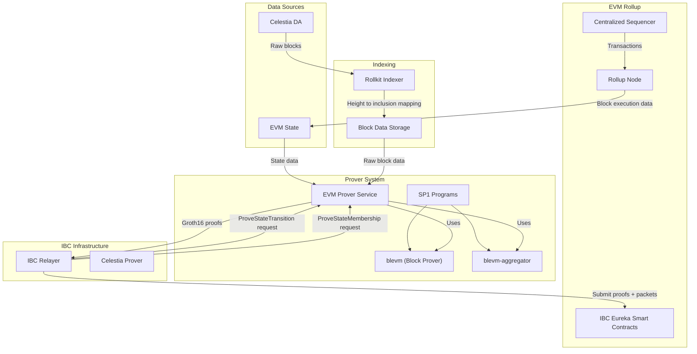
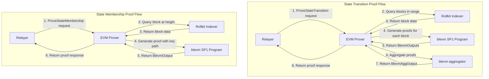

# EVM Prover

The EVM Prover implements the Prover service for EVM rollups, creating zero-knowledge proofs for state membership and state transitions. It uses SP1 programs (`blevm` and `blevm-aggregator`) to generate ZK proofs of data inclusion in Celestia and EVM execution using the Rollup State Prover (RSP).

## IBC Transfer Architecture

The EVM Prover is a key component in the IBC transfer architecture, enabling secure asset transfers between Celestia and EVM rollups.



## Architecture



## Flow Overview

The EVM Prover implements the Prover service protocol to provide zero-knowledge proofs for:
1. State membership verification
2. State transition verification

These proofs are used within the IBC (Inter-Blockchain Communication) protocol to securely transfer assets between the EVM rollup and other chains.



## Prover Service

The EVM Prover implements the following gRPC service:

```protobuf
service Prover {
  rpc Info(InfoRequest) returns (InfoResponse);
  rpc ProveStateTransition(ProveStateTransitionRequest) returns (ProveStateTransitionResponse);
  rpc ProveStateMembership(ProveStateMembershipRequest) returns (ProveStateMembershipResponse);
}
```

### Endpoints

#### Info
Returns information about the prover, including verifier keys.

#### ProveStateTransition
Generates a zero-knowledge proof of state transition for a given client ID (Tendermint light client contract address for EVM chains).

#### ProveStateMembership
Generates a zero-knowledge proof of state membership for a given client ID and key paths.

## SP1 Programs

### blevm

The `blevm` SP1 program generates proofs of data inclusion and execution for single EVM blocks.

#### Inputs:
- `KeccakInclusionToDataRootProofInput`: Data for inclusion proof
- `EthClientExecutorInput`: Data for EVM execution
- `celestia_header_hash`: Celestia block header hash
- `data_hash_bytes`: Hash of the block data
- `proof_data_hash_to_celestia_hash`: Merkle proof connecting data hash to Celestia hash

#### Output:
```rust
pub struct BlevmOutput {
    pub blob_commitment: [u8; 32],
    pub header_hash: [u8; 32],
    pub prev_header_hash: [u8; 32],
    pub height: u64,
    pub gas_used: u64,
    pub beneficiary: [u8; 20],
    pub state_root: [u8; 32],
    pub celestia_header_hash: [u8; 32],
}
```

### blevm-aggregator

The `blevm-aggregator` SP1 program aggregates multiple block proofs to create a proof over a range of blocks.

#### Inputs:
- `vkeys`: Verification keys for the proofs to aggregate
- `public_values`: Public values from the proofs to aggregate
- Proofs (automatically input)

#### Output:
```rust
pub struct BlevmAggOutput {
    pub newest_header_hash: [u8; 32],
    pub oldest_header_hash: [u8; 32],
    pub celestia_header_hashes: Vec<[u8; 32]>,
    pub newest_state_root: [u8; 32],
    pub newest_height: u64,
}
```

## Rollkit Indexer

The current architecture uses an indexer for Rollkit which:
- Maps EVM block heights to their inclusion heights in Celestia
- Stores raw block data submitted to Celestia
- Provides these as inputs for proving inclusion

This mapping is crucial for the EVM Prover to locate the correct Celestia blocks when generating proofs.

## Current Limitations and Future Work

### Current Limitations

1. **Matching Inclusion and Execution Data**: The system for matching inclusion data with execution data is not yet implemented.
2. **Sequencer Signature Verification**: Verification of sequencer signatures is pending implementation.

### Future Improvements

1. **Modular Proofs**: In the future, we should implement modular proofs that can:
   - Create inclusion, execution, and signature verification proofs in parallel
   - Verify proofs over a requested range in parallel
   - Improve throughput and reduce latency for proof generation

2. **Enhanced Indexer**: Improve the indexer to provide more efficient lookups and support for additional metadata.

3. **Optimized Proof Aggregation**: Implement more efficient algorithms for proof aggregation to reduce computational overhead.

## Input Data for Block Proving

```rust
pub struct BlockProverInput {
    pub inclusion_height: u64,
    pub client_executor_input: Vec<u8>,
    pub rollup_block: Vec<u8>,
}
```

## Aggregation Interface

### Input:
```rust
pub struct AggregationInput {
    pub proof: SP1ProofWithPublicValues,
    pub vk: SP1VerifyingKey,
}
```

### Output:
```rust
pub struct AggregationOutput {
    pub proof: SP1ProofWithPublicValues,
}
```

## Integration with IBC

The EVM Prover works in conjunction with the IBC Eureka Smart Contracts and Relayer to facilitate cross-chain communication and asset transfers. The proofs generated by the EVM Prover are used to verify state transitions and state membership across chains, ensuring security and integrity in cross-chain operations.
